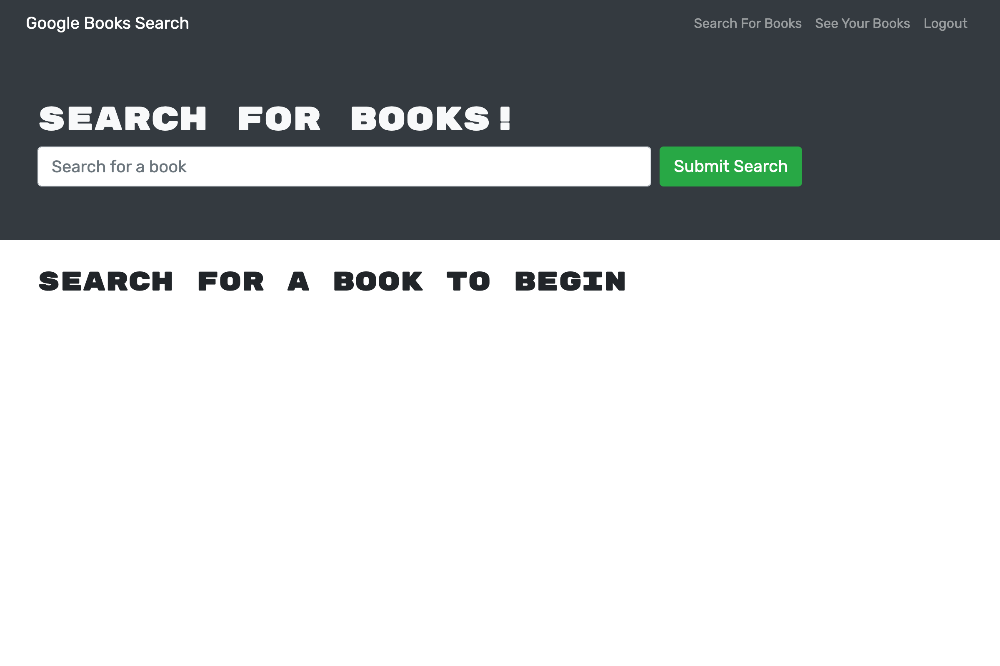

# RESTAPI TO GRAPHQL

### Description
This app was orignally a MERN stack app using a REST API which has now been converted to a GraphQL API using Apollo on both the client and server side. 

[Live Site](https://fictional-octo-giggle.herokuapp.com/)
### Installation
install dependancies

    npm install 

start server and client

    npm run develop

### Contributions
[Issues and Pull requests can be made to this repo](https://github.com/SuedePritch/fictional-octo-giggle)

### Technology
* React
* Apollo
* GraphQL
* Node
* MongoDB

